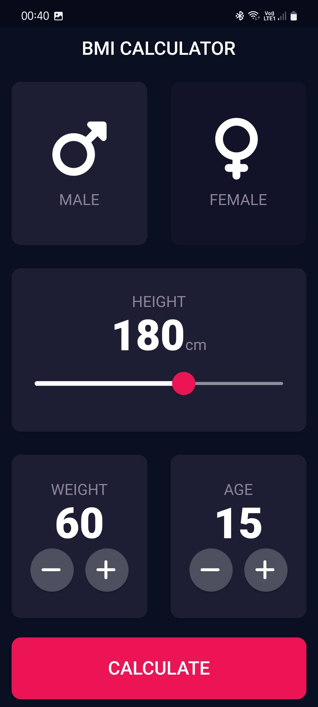
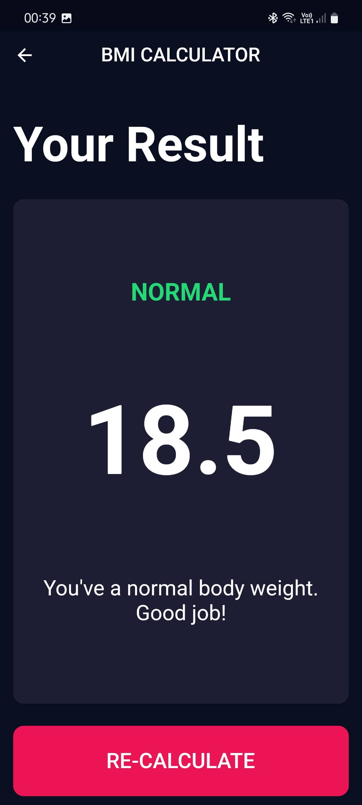
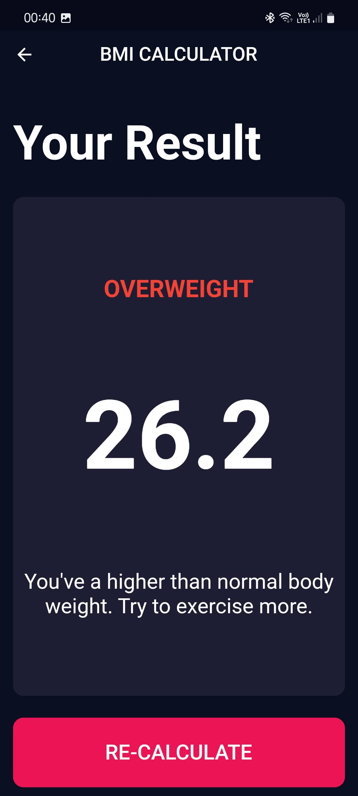

# BMI Calculator App
This is a BMI (Body Mass Index) Calculator app developed using Flutter. The app allows users to calculate their BMI based on their height and weight inputs. It provides a simple and intuitive user interface, along with the necessary logic to compute the BMI value and provide a corresponding interpretation.


### Screenshots
&nbsp;&nbsp;&nbsp;
&nbsp;&nbsp;&nbsp;
<br><br>


### Features
* User-friendly interface: The app offers a clean and intuitive interface for entering height and weight values.
* BMI calculation: The app computes the BMI value based on the user's height and weight inputs.
* Interpretation: It provides a corresponding interpretation of the BMI value, such as underweight, normal weight, overweight, or obesity.


### Installation
#### Clone the repository using the following command:
```bash
git clone https://github.com/iamkartiknayak/Flutter_TIC_TAC_TOE.git
```
#### Rename the project directory before running flutter commands
```bash
mv Flutter_BMI_Pro bmi_pro
```
#### Navigate to the project directory:
```bash 
cd bmi_pro
```
#### Install the dependencies:
```bash 
flutter pub get
```
#### Run the application:
```bash 
flutter run
```

### Usage
* Launch the application on your device/emulator.
* You will be presented with a screen to enter your height and weight.
* Enter your height and weight values in the corresponding input fields.
* Press the "Calculate" button.
* The app will calculate your BMI and display the result along with an interpretation.
* To calculate again, simply update the input fields and press the "RE_CALCULATE" button.


### License
This project is licensed under the MIT License.

### Acknowledgements
The development of this BMI Calculator app was made possible by the Flutter community's extensive resources. Special thanks to all those who contribute to the Flutter framework and its ecosystem.

Stay healthy and enjoy using the BMI Calculator app!
